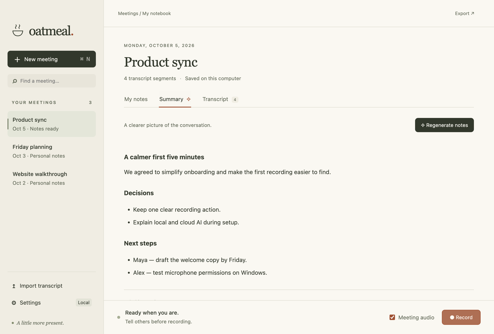
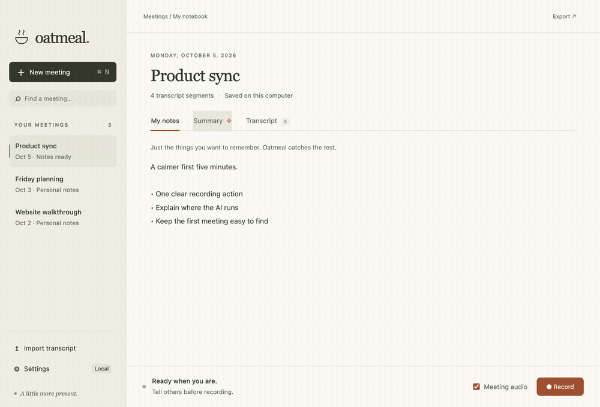

<div align="center">


# Oatmeal

### A little more present.

An open-source meeting notebook with local transcription and your choice of AI.<br />Listen, jot down a thought, and leave with the details that matter.

[](LICENSE) [](#your-meetings-your-choice) [](#try-oatmeal)

**[Try Oatmeal](#try-oatmeal)** · **[Watch the demo](#a-meeting-in-ten-seconds)** · **[On Publik ↗](https://publikhq.com/oatmeal-vedsoni-dev)** · **[Road to release](https://github.com/VedSoni-dev/oatmeal/pull/2)**



<sub>The actual desktop preview. Example meeting with fictional content.</sub>

</div>

## A notebook that listens

Your meeting is the main event. Oatmeal keeps a local transcript while you take the few notes that matter, then helps you find the decisions, commitments, and next steps.

**Capture the conversation.** Record your microphone and optional meeting audio. Whisper transcribes on your computer. No bot joins the call.

**Add your perspective.** Write in a clean notebook while the conversation flows. Notes save automatically.

**Keep what matters.** Make a summary, ask about the meeting, search your library, or export everything as Markdown.

## A meeting in ten seconds



<sub>UI walkthrough with fictional notes, transcript, and a prepared summary. Generation and recording are not shown.</sub>

## Your meetings, your choice

**Audio is transcribed locally.** Choose where the text goes when you ask for AI help.

<table>
<tr>
<td align="center" width="25%"><a href="https://claude.com"><picture><source media="(prefers-color-scheme: dark)" srcset="docs/assets/logos/claude-light.svg" /></picture><br /><strong>Claude</strong></a></td>
<td align="center" width="25%"><a href="https://openrouter.ai"><picture><source media="(prefers-color-scheme: dark)" srcset="docs/assets/logos/openrouter-light.svg" /></picture><br /><strong>OpenRouter</strong></a></td>
<td align="center" width="25%"><a href="https://ollama.com"><picture><source media="(prefers-color-scheme: dark)" srcset="docs/assets/logos/ollama-light.svg" /></picture><br /><strong>Ollama</strong></a></td>
<td align="center" width="25%"><a href="https://huggingface.co/docs/transformers.js"><picture><source media="(prefers-color-scheme: dark)" srcset="docs/assets/logos/huggingface-light.svg" /></picture><br /><strong>Local models</strong></a></td>
</tr>
</table>

| Option | How it works |
| --- | --- |
| **On this computer** | Download Whisper for speech and Qwen for text. Work offline after the downloads, with no account or usage bill. Small local text models select original meeting excerpts to preserve facts. |
| **ChatGPT subscription** | Sign in through the official Codex runtime. Your plan’s Codex limits apply. |
| **Claude subscription** | Sign in through the official Claude Agent SDK. Eligibility and usage follow your Claude plan. |
| **Your API key** | Connect OpenAI, Claude, Grok, or OpenRouter. Keys saved in Settings use operating-system encryption. |
| **Publik API** | Choose Fast, Balanced, or Smart. Link an account and use a shared Publik balance; the app shows costs and account links. A fresh install starts at $0.00. |
| **Ollama** | Connect to an existing local Ollama server and choose your model. |

Cloud requests require confirmation. Raw audio stays on your computer. Cloud providers receive meeting text only when you ask them for AI help. [Read the privacy and account details →](docs/desktop-guide.md#privacy-and-accounts)

## Try Oatmeal

**The desktop app is a development preview in [PR #2](https://github.com/VedSoni-dev/oatmeal/pull/2).** Apple Silicon development builds have been tested. Windows and Intel Mac packaging are configured, with platform validation still pending. Signed public installers are not available yet.

With **Node.js 22+**, run:

```sh
git clone --branch codex/desktop-app https://github.com/VedSoni-dev/oatmeal.git
cd oatmeal
npm ci
npm start
```

Oatmeal opens in its own desktop window. No coding agent or separate local model server is needed.

1. **Set up your models.** Open Settings and download a speech model. Choose local text, a subscription, Publik, or your own API key.
2. **Start a meeting.** Give it a name, press Record, and let participants know you’re taking notes. Turn on Meeting audio to include the other side of a call.
3. **Make it useful.** Add a few notes, stop recording, and choose Summary → Generate notes. Export when you’re ready.

<details>
<summary><strong>Build a Mac or Windows installer</strong></summary>

Run on the matching operating system and architecture:

```sh
npm run build:mac   # .app, .dmg, .zip — macOS 14.2+
npm run build:win   # NSIS installer — Windows 10/11 x64
```

Local builds are development artifacts. See [signing and release setup](https://github.com/VedSoni-dev/oatmeal/blob/codex/desktop-app/docs/RELEASING.md) before distributing them. Real subscription sign-in, platform audio permissions, and long meetings still need release validation; [verification status](https://github.com/VedSoni-dev/oatmeal/blob/codex/desktop-app/docs/VERIFICATION.md) records what was actually tested.

</details>

## Bring your coding agent

The original browser recorder and Markdown workflow are still here. Work with meeting files in **Cursor, Claude Code, Codex, or another MCP client**.

<table>
<tr>
<td align="center" width="33%"><a href="https://cursor.com"><picture><source media="(prefers-color-scheme: dark)" srcset="docs/assets/logos/cursor-light.svg" /></picture><br /><strong>Cursor</strong><br /><sub>MCP + Markdown</sub></a></td>
<td align="center" width="33%"><a href="https://claude.com/product/claude-code"><picture><source media="(prefers-color-scheme: dark)" srcset="docs/assets/logos/claude-light.svg" /></picture><br /><strong>Claude Code</strong><br /><sub>Skills + MCP</sub></a></td>
<td align="center" width="33%"><a href="https://developers.openai.com/codex"><br /><strong>Codex</strong><br /><sub>MCP + Markdown</sub></a></td>
</tr>
</table>

The MCP server exposes `list_meetings`, `search_meetings`, and `get_meeting` for Markdown files. Export desktop meetings into the folder you configure for MCP; it does not automatically read the desktop database. **[Agent setup guide →](docs/agent-workflow.md)**

## Built to stay yours

- **Plain Markdown exports.** Take your notes and transcripts to another tool whenever you want.
- **Local storage.** Meetings stay in your application data folder. Pending audio is saved temporarily for recovery, then deleted after transcription succeeds.
- **Recoverable recordings.** Interrupted transcription can resume from saved audio chunks.
- **Open source.** Inspect the code, change the prompts, add a provider, or build your own version.

Meeting files are not encrypted by the app. System-audio capture depends on the OS, permissions, and chosen source. You/Room separates audio lanes, not individual remote speakers.

## Make it better

<p><a href="https://www.electronjs.org"><picture><source media="(prefers-color-scheme: dark)" srcset="docs/assets/logos/electron-light.svg" /></picture></a> Built on Electron, with local models powered by Transformers.js.</p>

Bug reports, thoughtful design feedback, and pull requests are welcome. Include your OS, provider, and steps to reproduce; keep meeting content and credentials out of public issues.

On the desktop preview branch:

```sh
npm test
npm run test:desktop
```

[Desktop guide](docs/desktop-guide.md) · [Architecture](https://github.com/VedSoni-dev/oatmeal/blob/codex/desktop-app/docs/ARCHITECTURE.md) · [Release checklist](https://github.com/VedSoni-dev/oatmeal/blob/codex/desktop-app/docs/RELEASING.md) · [Report an issue](https://github.com/VedSoni-dev/oatmeal/issues)

---

MIT © Vedant Soni. An independent Granola alternative. [WhimprFlow](https://github.com/Blueturboguy07/WhimprFlow) inspired the platform and release patterns. Product names and logos identify the tools and services described; they belong to their respective owners and do not imply endorsement. [Asset credits](docs/assets/README.md)
